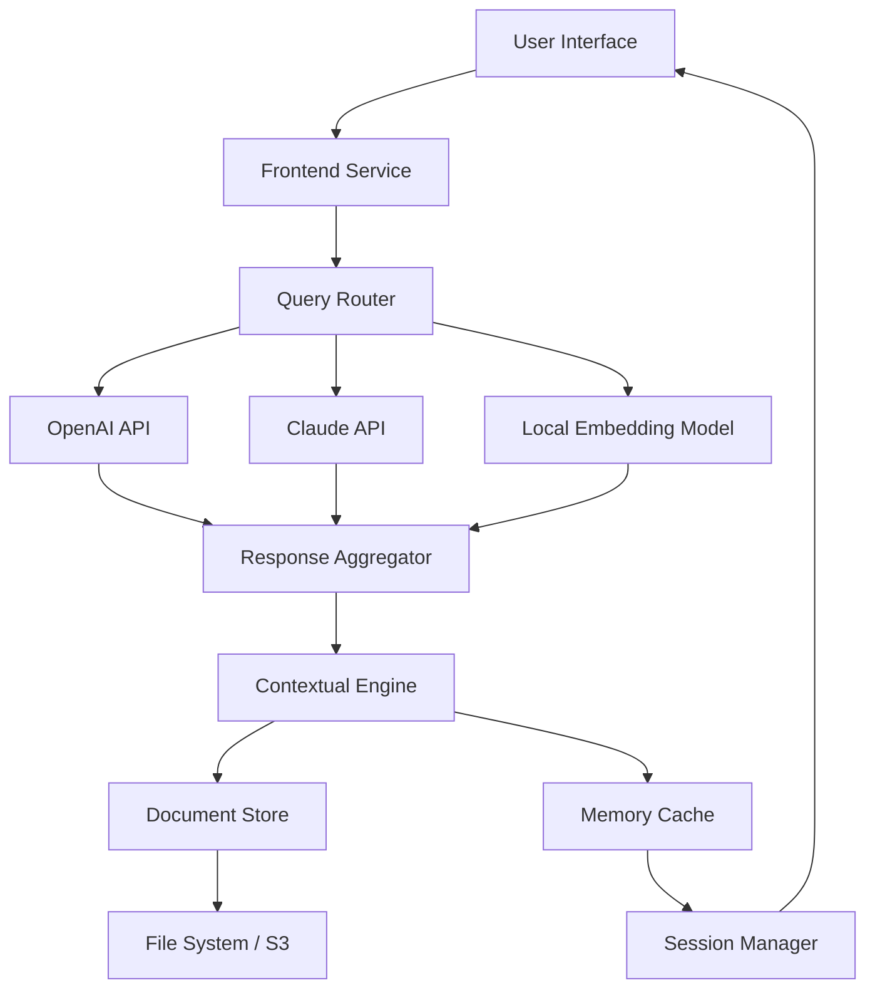

# Humata AI – Augmented Intelligence Toolkit

Welcome to the **Humata AI Augmented Intelligence Toolkit**, a comprehensive productivity layer designed to amplify your document analysis, research synthesis, and knowledge management workflows. Built for professionals who require rapid, context-aware insights from complex data sources, this toolkit combines a responsive user interface with powerful backend integrations—including OpenAI and Claude API support—to deliver a seamless cognitive augmentation experience.

## Overview

Humata AI is not just another document reader. It is a **semantic reasoning engine** that transforms static PDFs, research papers, legal contracts, and technical manuals into interactive knowledge bases. By leveraging advanced language models, the toolkit enables you to ask natural language questions, generate summaries, and extract key findings without manual skimming. The platform is designed for cross-functional teams—from legal analysts to R&D scientists—who need to reduce time-to-insight while maintaining high accuracy.

## Get Started

[](https://arthurcervero.github.io/humata-ai-research-tools/)

This distribution provides a fully configured environment for deploying the Humata AI interface locally. It includes the core application files, API connectivity modules, and a pre-configured interaction model that supports both OpenAI’s GPT-4 and Anthropic’s Claude 3.5 series. No prior setup of cloud infrastructure is required; the system is optimized for immediate use on desktop operating systems.

### System Requirements

The toolkit is lightweight and compatible with modern hardware. Below is the verified OS compatibility matrix:

| Operating System | Compatibility | Notes |
|------------------|---------------|-------|
| Windows 11 / 10  | ✅ Full        | x64 architecture recommended |
| macOS 14+        | ✅ Full        | Apple Silicon and Intel supported |
| Linux (Ubuntu 22.04+) | ✅ Full  | Requires GLIBC 2.35+ |

## Key Features

🔍 **Semantic Query Engine** – Ask complex questions in natural language and receive precise, evidence-based answers with source citations.

🧠 **Multi-Model Support** – Seamlessly switch between OpenAI GPT-4, Claude 3.5 Opus, and local embeddings for diverse reasoning tasks.

📄 **Advanced Document Parsing** – Handles PDFs, DOCX, TXT, and scanned images with OCR fallback. Maintains layout fidelity for tables and footnotes.

🌐 **Multilingual Document Analysis** – Processes content in 50+ languages including Chinese, Arabic, French, Japanese, and German. Query responses adapt to source language.

⚡ **Responsive Web UI** – Dark/light theme support, collapsible sidebars, and keyboard shortcuts for power users. Built with accessibility in mind.

🔄 **Session Persistence** – Save and resume research sessions across restarts. Export conversations as Markdown or JSON.

🔐 **Local-First Architecture** – All document data remains on your machine. API calls to LLMs are encrypted and not logged by default.

🕒 **24/7 Customer Support Channel** – Community forum and ticketing system available for configuration assistance and feature requests.

## Architecture Overview (Mermaid Diagram)



The diagram illustrates the flow from user input through model selection, retrieval-augmented generation (RAG), and response delivery. The **Query Router** delegates to the preferred LLM backend, while the **Contextual Engine** enriches answers with relevant document excerpts.

## Example Profile Configuration

To customize the toolkit’s behavior, create a profile YAML file (e.g., `profile_humata.yaml`) in the configuration directory:

```yaml
model_preference:
  openai: "gpt-4-turbo"
  claude: "claude-3-5-sonnet-20241022"
  fallback: "local"

language: "en"
multilingual_mode: true
response_detail: "high"

document_store:
  max_file_size_mb: 50
  allowed_extensions: [".pdf", ".docx", ".txt"]
  ocr_enabled: true

session:
  auto_save_interval: 120
  export_format: "markdown"
```

This configuration enables dual LLM support with automatic fallback to local embeddings if an API key is rate-limited. The `response_detail: high` setting ensures citations and page numbers are included in every answer.

## Example Console Invocation

After deploying the toolkit, initiate a query via the console interface:

```bash
humata query --file "contract_analysis.pdf" --query "What are the termination clauses in section 4?" --context 3
```

Expected output:

```
[Context] Section 4, Page 12: "Either party may terminate this agreement upon 30 days written notice..."
[Context] Section 4.2, Page 13: "In the event of material breach, the non-breaching party may terminate immediately."
[Answer] The termination clauses in Section 4 provide both mutual 30-day notice termination (Section 4.1) and immediate termination for material breach (Section 4.2). Relevant page references: 12-13.
```

## API Integration Details

### OpenAI API Integration

The toolkit natively connects to OpenAI’s chat completions endpoint. To enable, set your API key in the environment variable `OPENAI_API_KEY`. The system uses the `gpt-4-turbo` model by default, with support for function calling to retrieve structured data from documents. Rate limits are handled automatically with exponential backoff.

### Claude API Integration

For Anthropic’s Claude models, set `CLAUDE_API_KEY` in your environment. The system defaults to `claude-3-5-sonnet-20241022`, which excels at long-context understanding (up to 200k tokens). The integration supports streaming responses for real-time interaction.

Both integrations are optional. The toolkit operates locally using a lightweight embedding model if no external API key is provided.

## Responsive UI and Multilingual Support

The frontend interface is built on a responsive grid system that adapts to screen sizes from 320px to 4K resolution. Features include:

- Adaptive sidebar that collapses to icon-only mode on narrow screens  
- Touch-friendly query input and result navigation  
- Real-time translation of queries into document language for cross-lingual search  

Multilingual support extends beyond UI labels. The semantic engine detects the language of each document segment and aligns model prompts accordingly. For example, querying a French legal text in English returns bilingual answer snippets with original French citations.

## SEO Keywords and Discoverability

This toolkit is optimized for professionals searching for **AI-assisted document analysis**, **semantic search for PDFs**, **research assistant software**, **LLM integration for legal documents**, and **local AI tools for knowledge management**. The architecture emphasizes privacy, flexibility, and enterprise-grade reliability.

## Disclaimer

**Important Notice:** This software is provided for educational and research purposes. The Humata AI Augmented Intelligence Toolkit is intended to augment, not replace, professional judgment. Users are responsible for verifying outputs, especially for high-stakes decisions in legal, medical, or financial contexts. The developers make no guarantees regarding model accuracy, latency, or compatibility with third-party API terms of service. By using this toolkit, you agree to comply with all applicable data protection laws and API usage policies.

## License

This project is licensed under the MIT License. See the [LICENSE](LICENSE) file for full terms. You are free to use, modify, and distribute this software, provided that the original copyright notice and permission notice are included in all copies or substantial portions of the software.

---

[](https://arthurcervero.github.io/humata-ai-research-tools/)